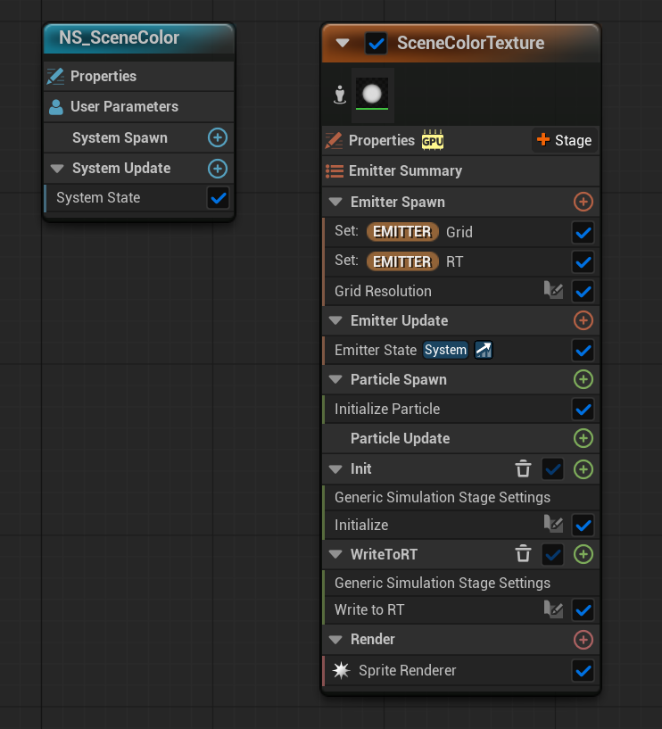
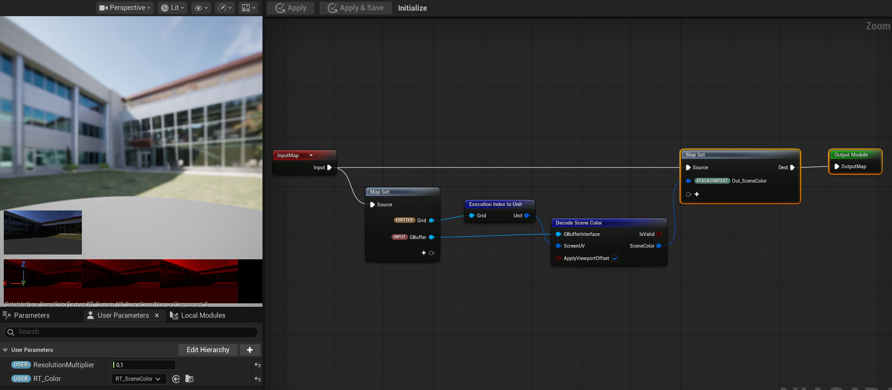
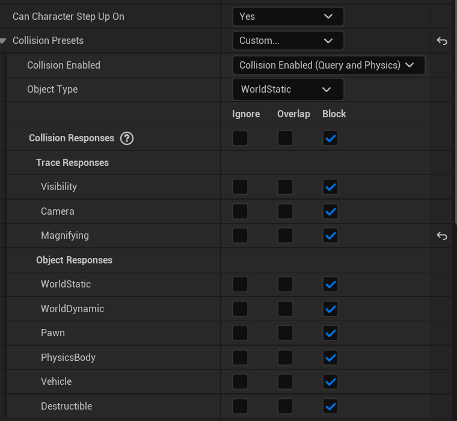
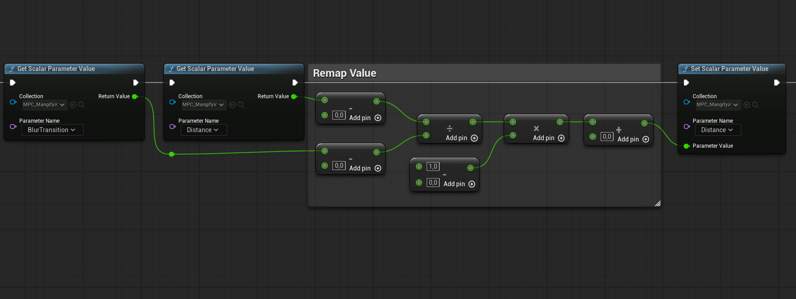
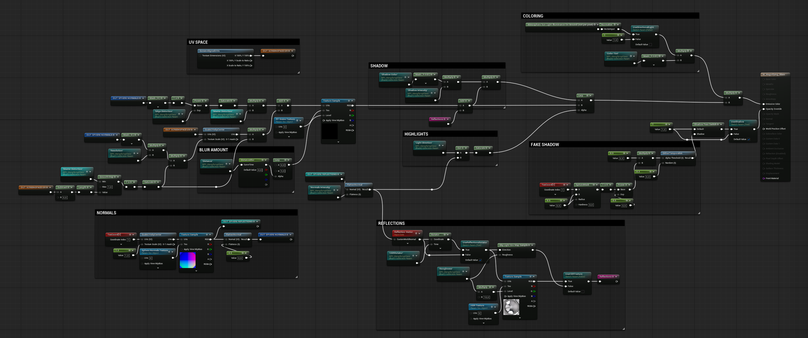
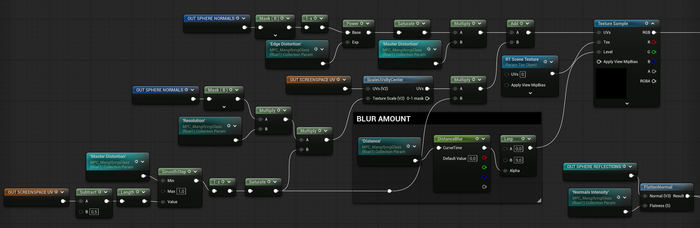
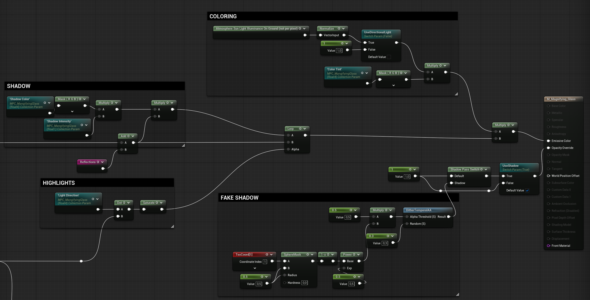
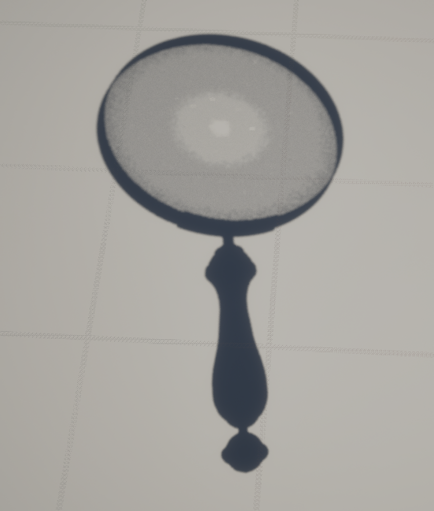

Softwares used:
* Unreal Engine 5.7
* Houdini



The idea was to create a procedural shader that allows me to art direct the physical properties of a lens like distortions, magnification and reflections.



The magnifying glass was modeled and textured procedurally in Houdini using the Copernicus system of Houdini 21.0, making it easy to create iterations fast and with full control.



The main goal was for the shader to be lightweight, efficient and easy to use.

The scene color was sampled using Niagara's GBuffer Interface and stored in a Render Target Texture to then be sampled in the material.

This technique allows the user to have maximum control over the size and resolution of the texture.

The dynamic focus, magnification and distortions of the lens were driven by a Line Trace logic inside the Blueprint Actor of the asset.

The distance between a surface and the focal point of the lens drives every other parameter of the shader.

Every important parameter is stored in a Material Parameter Collection to be easily accessible through Blueprints, Niagara Systems and Material Shaders.

The shader was developed with efficiency and art-directability in mind.

The actual lens of the model is just a 2D plane that, with the use of a spherical normal texture, creates the illusion of a thick magnifying lens.

The normal texture was used to create complex spherical distortions and to resize the Scene Color texture. Additionally, a blur amount value based on the Mipmap levels creates the illusion of defocusing when the lens is far away from a surface.

All lighting properties like reflections, shadows and highlights were calculated with textures and simple masks to keep the effect as optimized as possible.

A custom shadow parameter was added using the "Shadow Pass Switch" node to further increase the realism of the effect.

Read the complete breakdown for the Modeling:

Modeling breadown


Read the complete breakdown for the Shader:

Shader breakdwon
