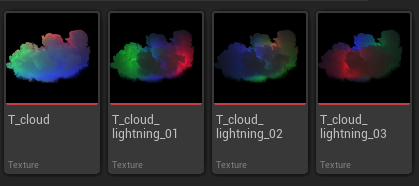
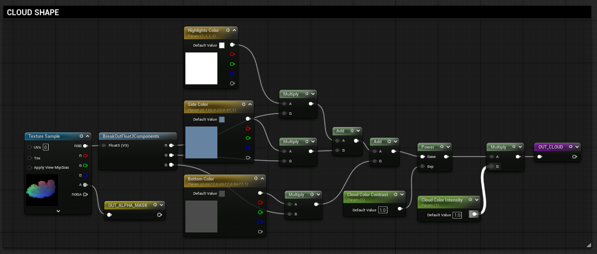
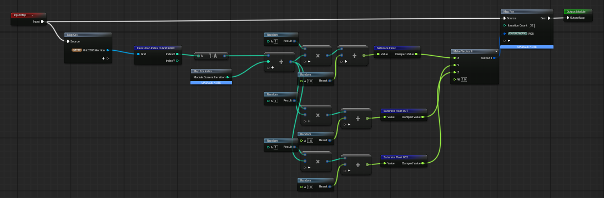
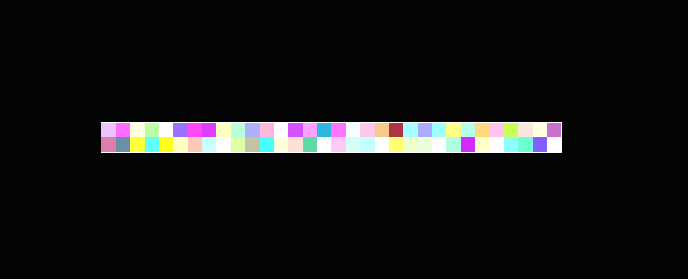
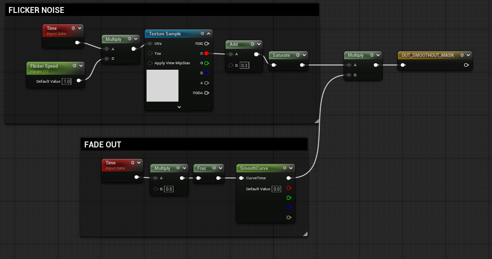

Software used:
* Unreal Engine 5.7
* Embergen

In this personal project I wanted to create a system that allows the user to generate randomized lightning strikes on a 2D cloud image.

I wanted the effect to look realistic and powerful, suitable for environment effects and skies.



I created a cloud texture using Embergen and rendered it with a three point light system.

The first texture (T_Cloud) was used to colorize the cloud inside Unreal Engine 5.7.

The other three textures were RGB lights in random positions and were used to drive the whole lightning effect.

I created a texture in a render target with random colors using Niagara's Grid 2D system.

Then, inside the Cloud's shader I created a logic that switches between each color of the render target with random timing.

This way, by randomizing both the render target's colors and the pattern that they are changing inside the material, I created emissive masks for the cloud that create the illusion of lightning strikes on a brewing storm.


Read the complete breakdown
