Software used:
* Unreal Engine 5.4
* Photoshop

For this effect I had to create a fire-beam that starts from a sun-like sphere and tracks the player within a specified angle.
The player in this platformer metroidvania was able to jump, teleport and fly around the level so every part of the effect could potentially be visible.

For the beam I used three ribbon emitters in Niagara with the same material and a fourth with a flare effect.

Each emitter had slightly different values like color, emissive intensity and texture stretching amount to create a more detailed and interesting final output.

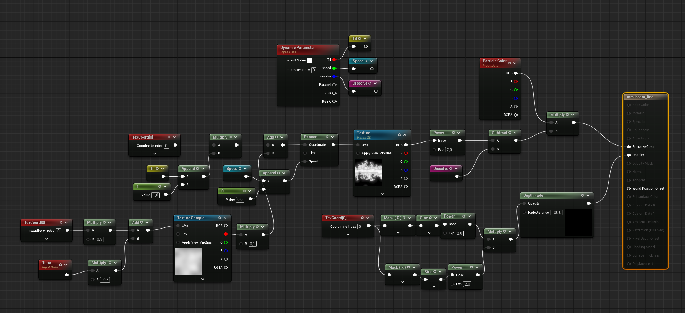

For the sun effect I used a simple tiling noise texture with Radial UVs to create a fire-rays effect. Also, using a color curve I created the purple to red colorization that gave the illusion of extremely hot temperatures on its core.

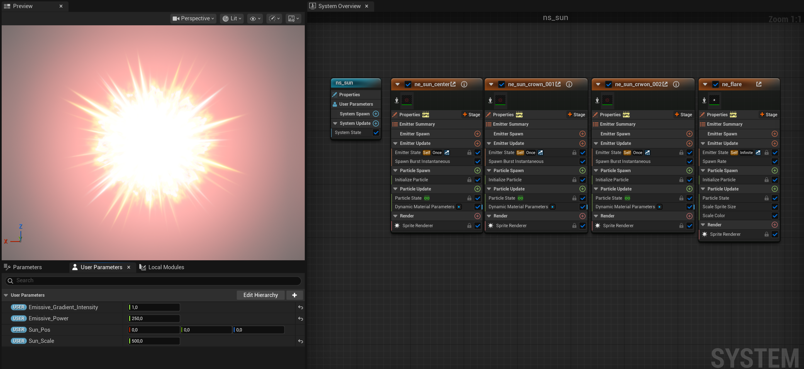

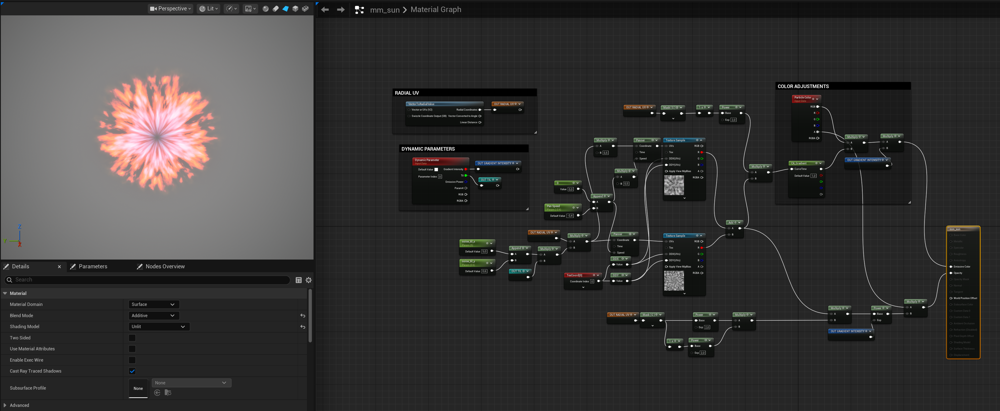

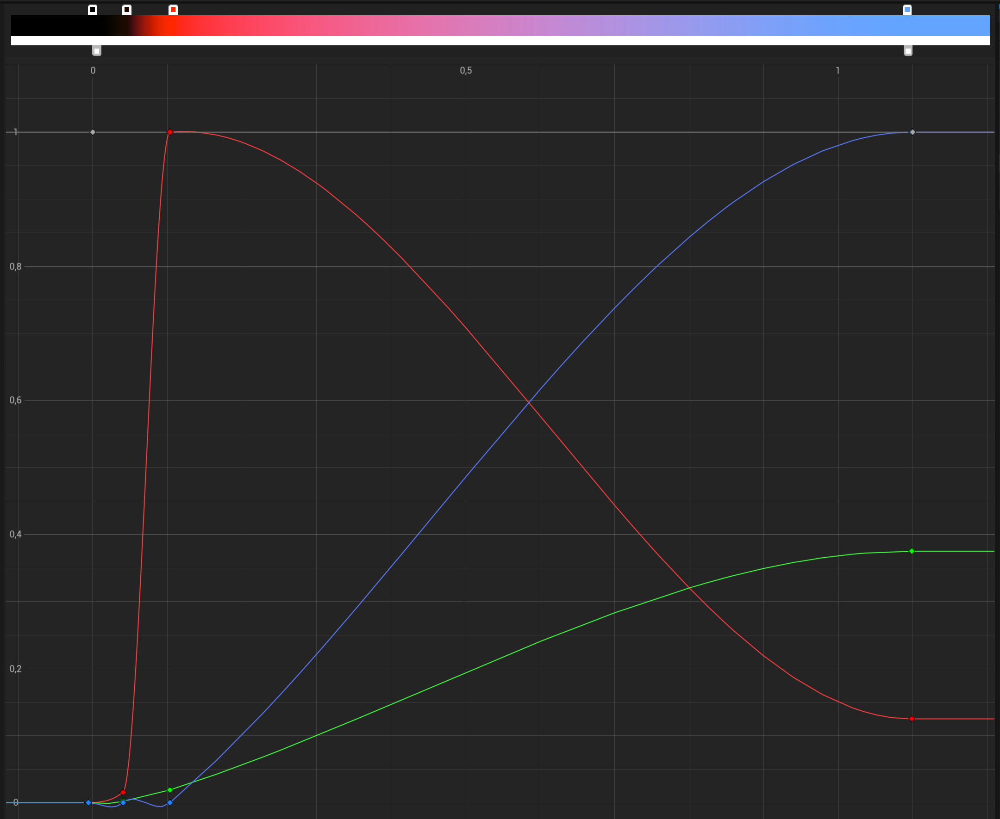

A star texture was used for the sun's pointy beams, adding a more stylized yet menacing look.

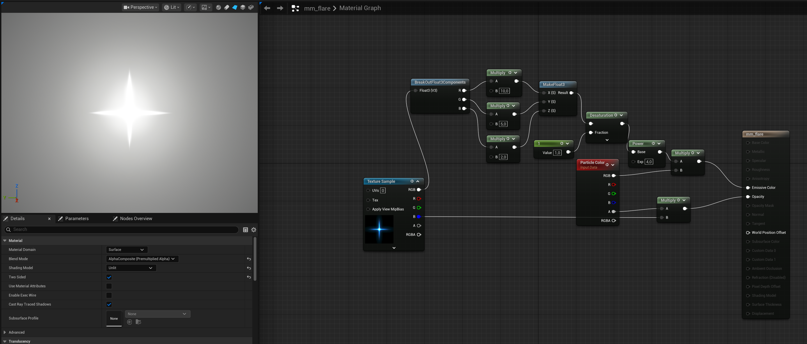

For the ground destruction along the beam's path I used four emitters for debris, dust, smoke and fire.

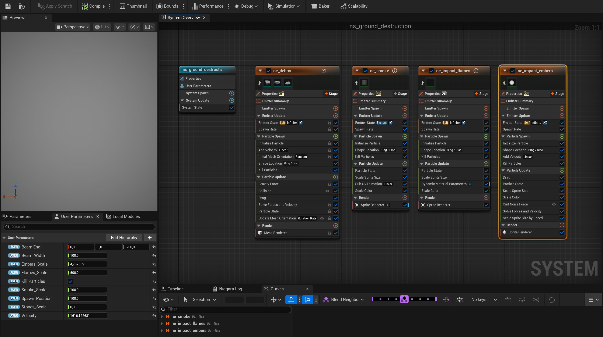

I tried to match the fire texture with both the beam patterns and the rest of the fire effects of the game that lean more towards stylization than realism. For that reason I used a tiled noise pattern with a conical mask that gave the illusion of bursts of flames on the ground.

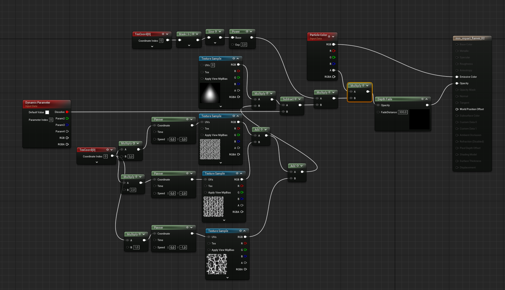

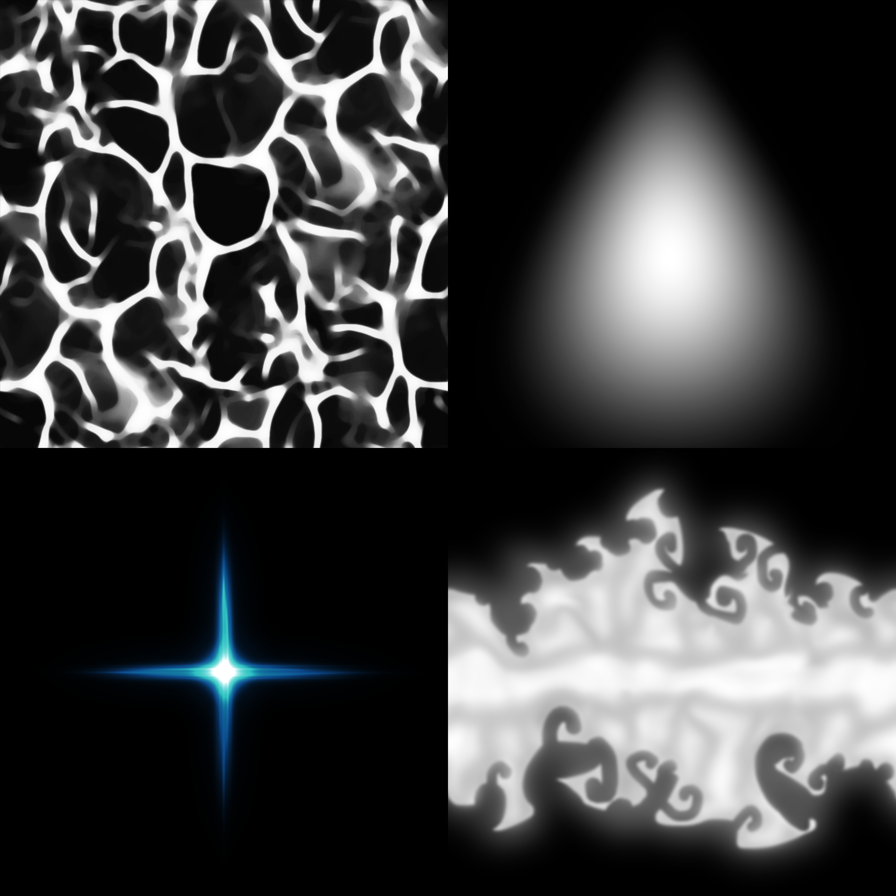

The beam was animated in blueprint so that game programmers could easily adjust the logic for different scenarios.

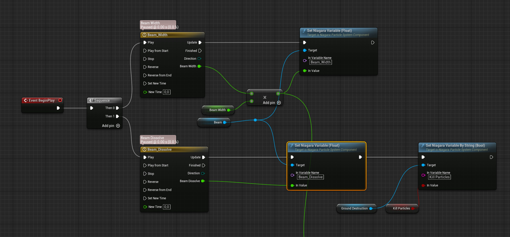

The start and end of the beam were driven by a line trace that searches for the closest geometry. At the collision point of the line trace the ground destruction effect was spawned.

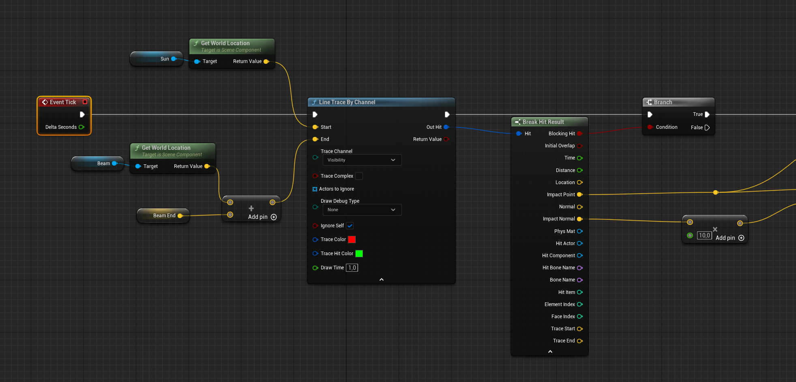

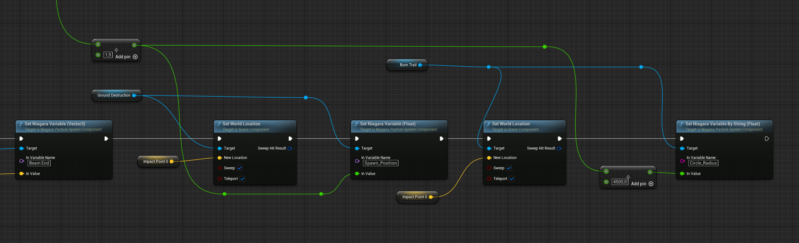

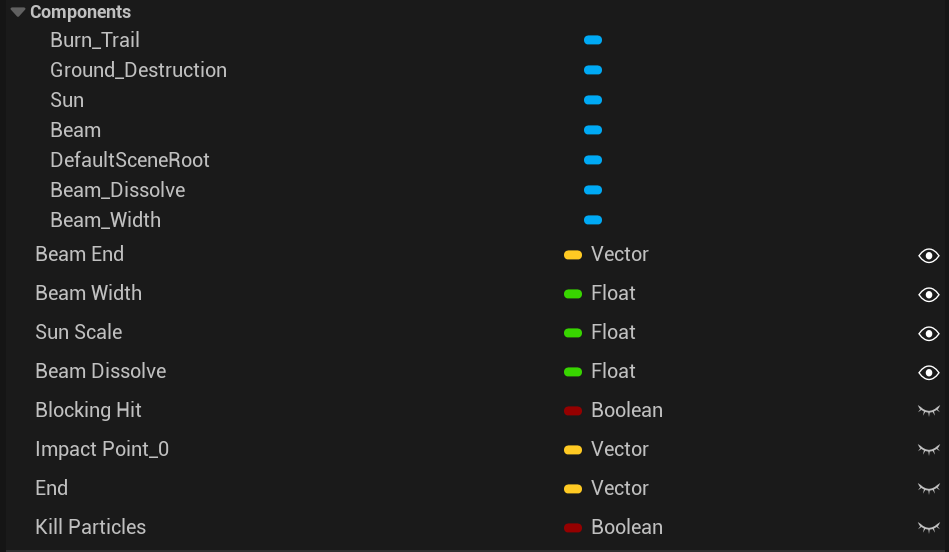

This blueprint logic was more of a reference for the programmers that added the effect to the actual game.