

The goal of this project was to create a procedural magnifying glass shader that actually let me art direct properties like image distortion, magnifying amount and reflections on the lens.

## Sample the Scene Color

The first step to achieve this was to find an efficient way to sample the scene color inside a simple Unlit material. The reason was that I wanted to control the Mipmap values to create a blurriness (de-focusing) illusion when the distance between the lens and a surface is increased.

And for one more time Niagara's Grid 2D was extremely handy. Utilizing the Gbuffer interface inside Niagara I wrote the Scene Color properties in a dynamic Render Target with controllable resolution. That technique, not only gave me control over the mipmaps but also allowed me to control the general size of the render target to either keep my effect lightweight or highly sharp when it's needed.

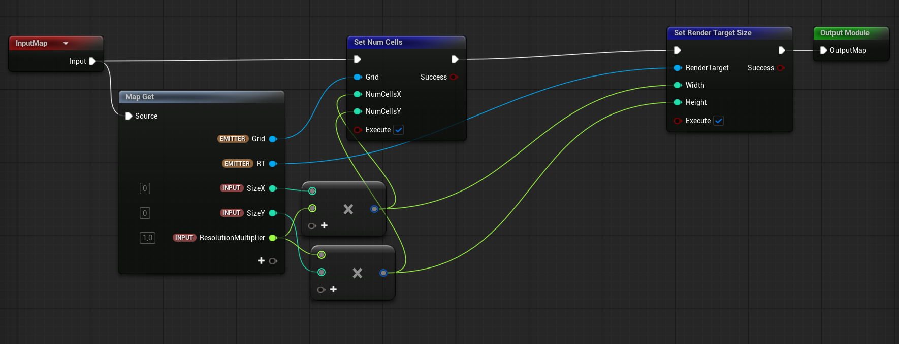

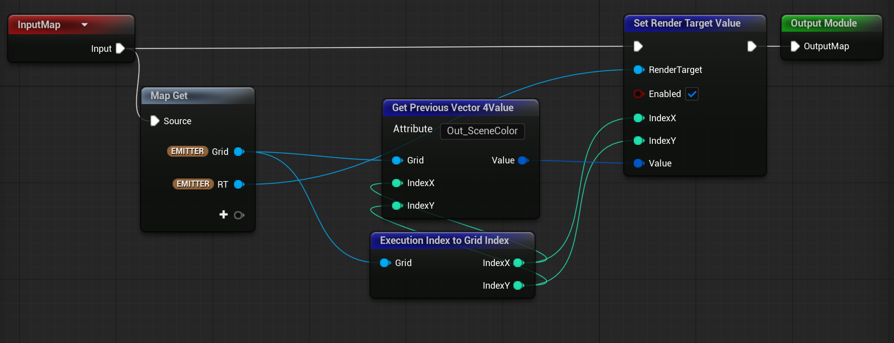

## Creating the Actor

Then, I created a blueprint actor with the actual magnifying glass geometry (see my previous article), the Niagara System that writes the Scene Color into the Render Target, a placeholder Sphere geometry that is invisible in gameplay and a collision trigger sphere.

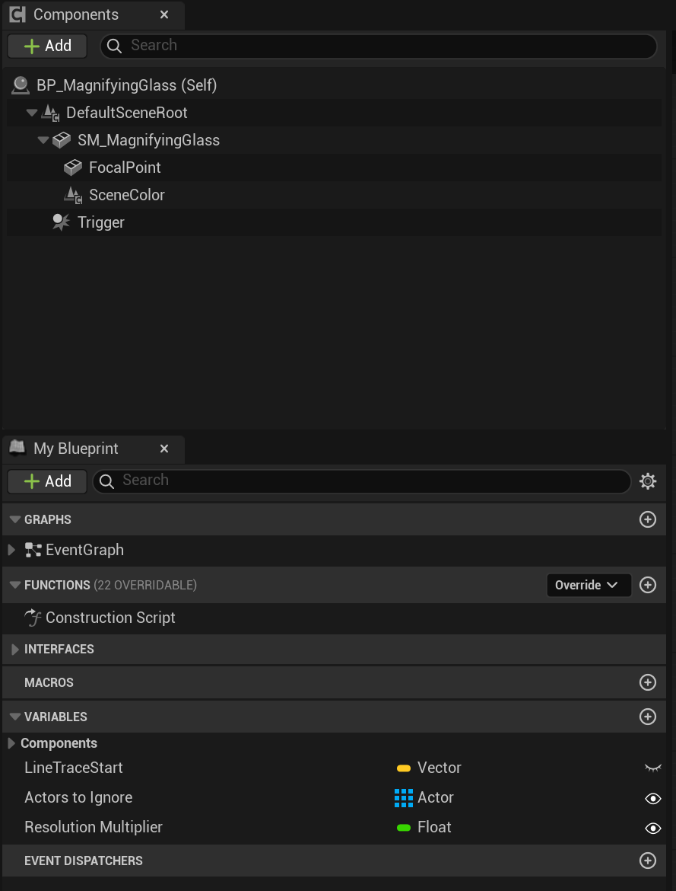

The sphere geo was placed at the center of the lens and called "Focal Point". Its position was used to shoot a line trace in every tick that searches for geometries with a specified Trace Channel in the level. The idea behind this setup was to avoid an annoying snapping when the line trace was changing size fast. I created a new Trace Channel called Magnifying and set it to Ignore for all objects except those I wanted to be my actual targets for my glass. Those objects were large (and ideally flat) surfaces like walls, tables, boxes etc. Then I used the calculated distance between the surface and my focal point to calculate the magnifying amount and the focus of my lens.

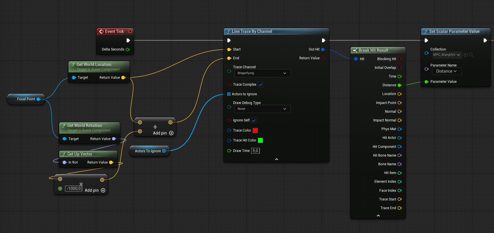

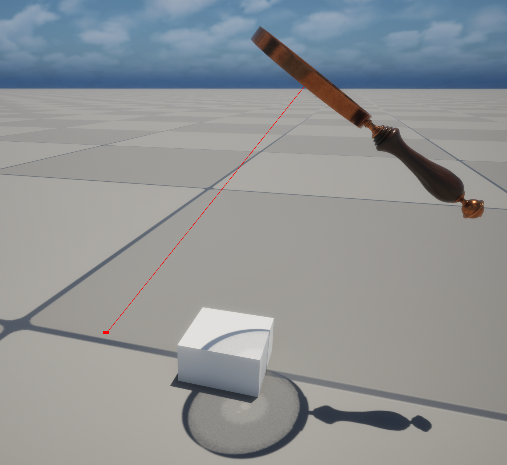

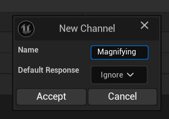

## Some shader magic

The values were stored in a Material Parameter Collection to easily connect the Blueprint, Shader and Niagara setups.

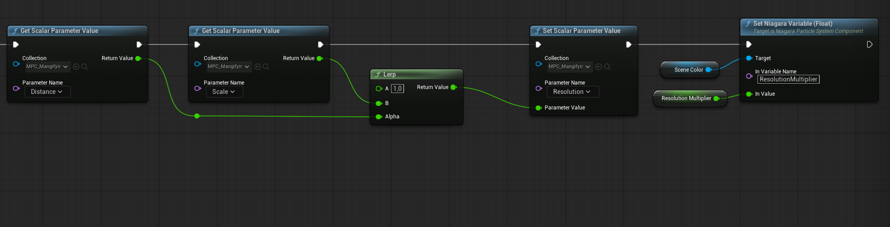

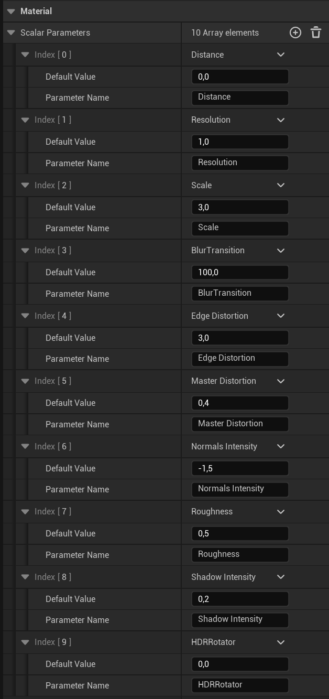

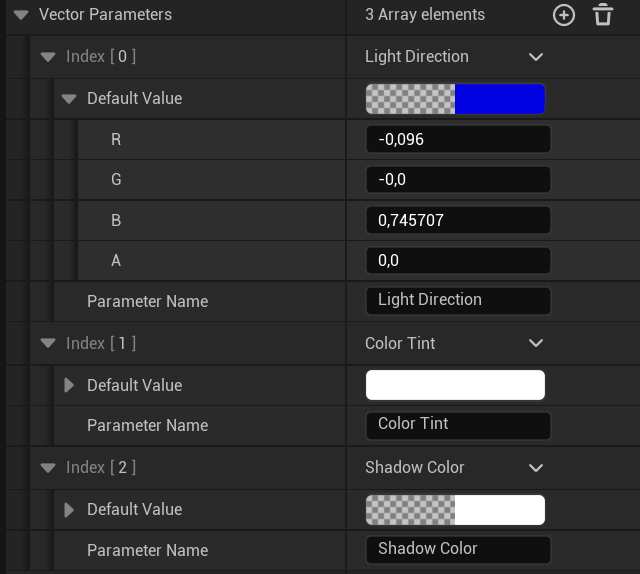

The shader was developed around the idea of faking as much as possible without sacrificing much of its realism.

The key property of the shader was a spherical normals texture that was used as the base of every other effect.

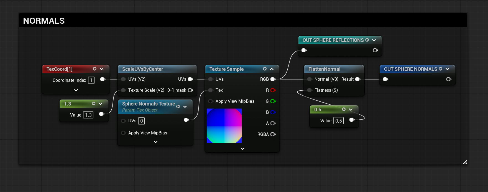

The spherical distortions were the most tricky part of the whole system because they were the actual selling point. They had to be as physically based as possible and art-directable at the same time.

The screen space UVs combined with the spherical normals allowed me to distort the edges of the lens while keeping the center undistorted. At the same time, using the "Scale UVs by Center" node, I managed to have a similar effect for the magnifying amount in reverse (scaled up mostly in the center), creating an almost fish-eye like behaviour.

As discussed earlier, I used the mip levels (0-9) of the texture to create the defocusing effect. A float curve helped the transition from the sharp to the blur stage become smoother at the start and increase exponentially when the lens is far away from the surface.

At this point I had managed to create a nice and controllable lens effect but it was still not convincing enough. There is no true lens without proper light interaction.

The first, and most important thing was the reflections. To keep the effect optimized I decided to use a HDRI setup with a reflection vector. The "Sky Light Env Map Sample" was extremely helpful as it samples the Sky Light of each level automatically and also gives a Roughness value that in the custom HDRI setup was faked using mip levels again.

The PBR or stylized lighting setups that can be used are almost infinite and can be scaled in extreme complexity. In this specific project I decided to keep it as lightweight and simple as possible and make sure that I won't spare much time on things that won't be visible or add any relevant details to the effect.

The switch parameter that changes the Sky Light with a Studio HDRI was used for the turntable render (see previous article). Also, the UVs rotator was used to fake the rotation of the reflections on the lens in the turntable render. That was critical to create convincing reflections on the beauty render but quite overkill in gameplay, so the switch values keep the shader clean from unnecessary calculations.

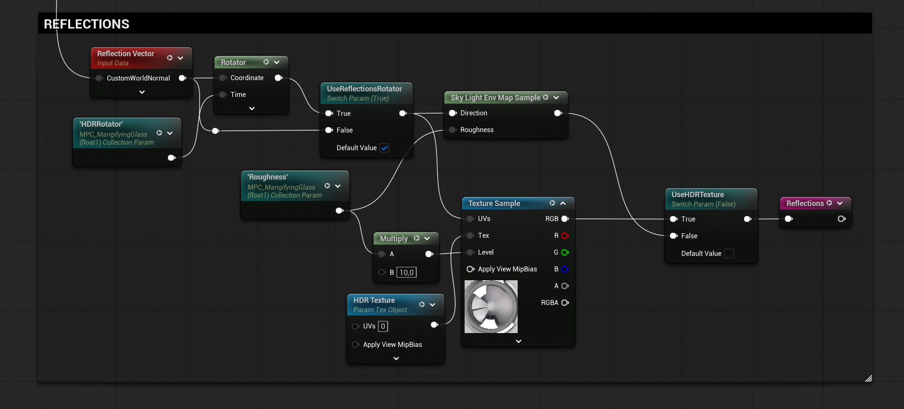

In the final stage of the shader I created some custom highlights and shadows on the lens by using BW masks based on Normals and custom vectors. Then I added a color tint based on the directional light's color of the scene to help the projected image blend properly with the environment, like the light is coming through colorized glass.

Last but not least, a fake shadow based on a sphere mask was used to create a fake glass-caustic effect that ended up far more convincing than I initially expected. Not an extremely important addition but a nice touch nevertheless.

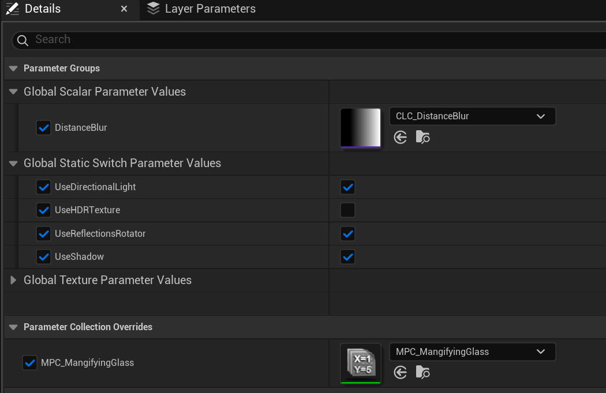

## Used it in game

On the interactivity side, the collision sphere of the actor was used to add a simple logic of picking up the magnifying glass to test it in actual gameplay simulation.

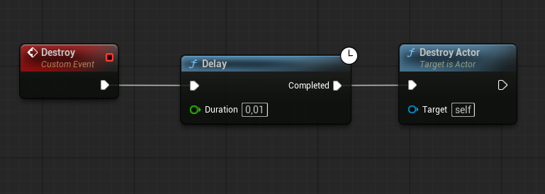

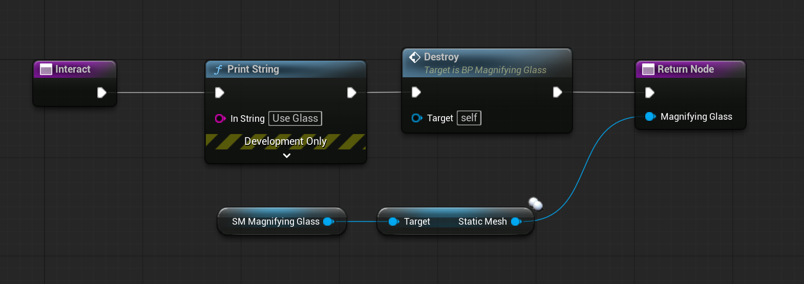

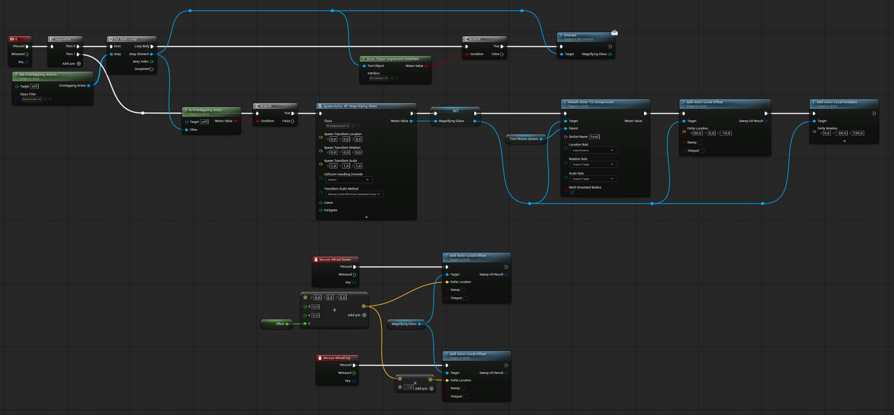

## Conclusion

I'm really happy with the results of the project and learned a lot of fun little tricks along the way. I hope that there are more people that will find these ideas interesting and find a way to incorporate them in their games or interactive projects.

## Assets
* Environment by Anatolii Umanets in Fab: https://www.fab.com/listings/82fea2b7-ffde-4a9f-9ec7-17faa7504477