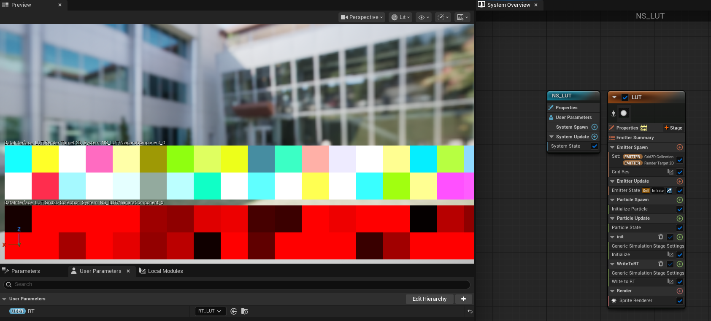
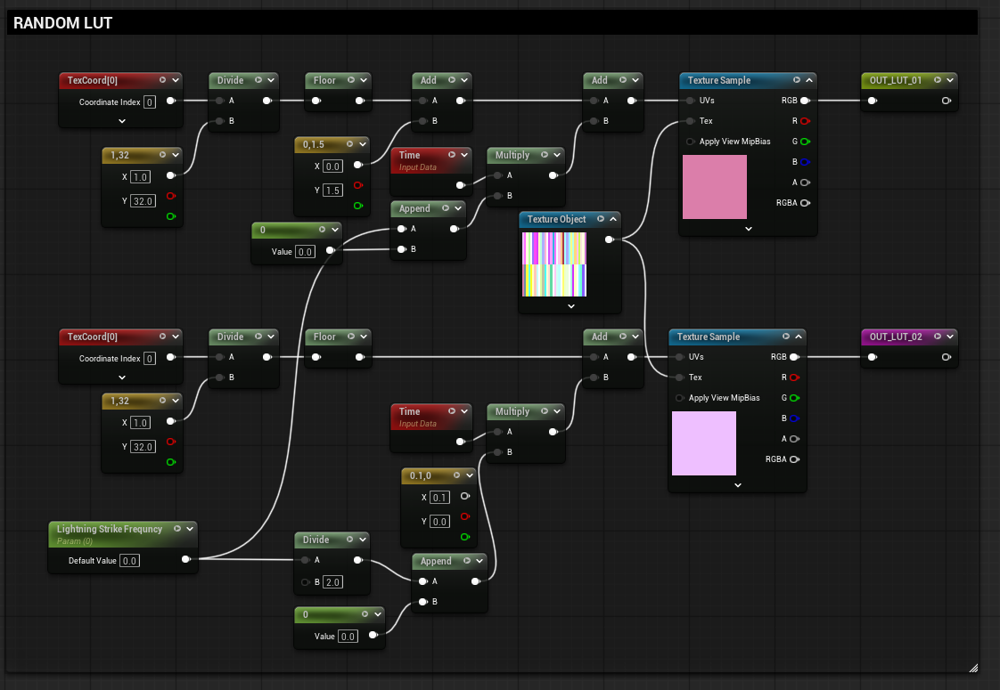
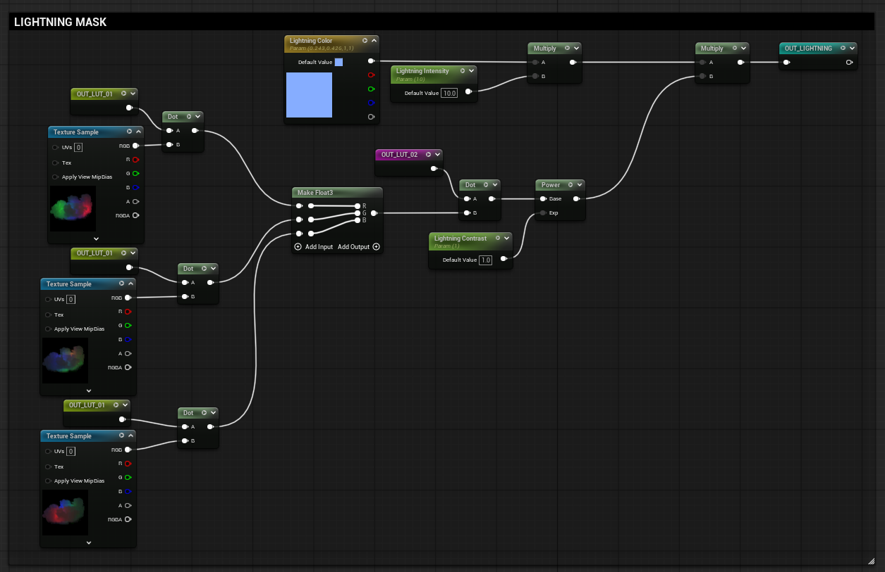
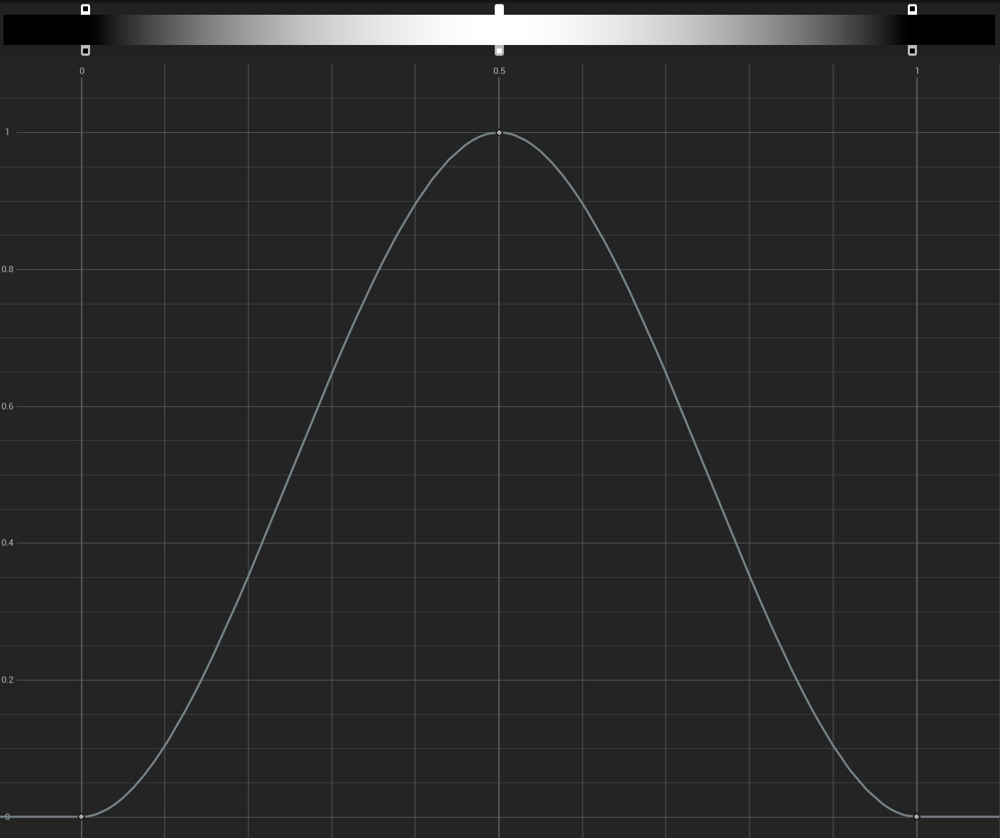



The intention behind this small project was to study different possible ways of creating **randomized behaviors** inside **Unreal Engine's Material Edito**.

I wanted to use nothing but **Textures**, avoiding sine, cosine nodes, which are common used to generate noisy-random logic but are often best avoided due to their **performance cost**.

To test these ideas, I chose to create a **Storm Cloud** texture on a single plane, where I could control the position at which lightning strikes would spawn within it, following an almost **infinite random pattern.**

### Cloud Texture

The cloud was created in **Embergen** and utilizes a three-point lighting system with randomized positions and RGB values for shading.

The system is based on 1 RGBA Texture of High Resolution (2K - 8K) and 3 RGB Low Res Textures (512 pixels).

The main Cloud Texture uses the RGB Channels to simulate the Highlights and Shadows of the cloud. 
The material is a simple **Unlit Translucent Material**, meaning environmental lighting conditions must be adjusted manually.

### LUT Texture

The random color texture (**32x2 pixels**), which functions similarly to a **Look Up Table (LUT)** was generated procedurally in Niagara using the **Grid2D** interface.

A simple for loop iterates over each cell of the grid and assigns it a random color.

While it is possible to create this texture in software such as Photoshop or Substance Designer, generating it procedurally in runtime, allows the texture to change over time, completely eliminating repetition. 

Single Channel of Random Indices.

RGB Channels.

### Assemble the shader logic

The dot product of two vectors is zero when the vectors are orthogonal.
This is the same principle used by Fresnel, where the dot product between the camera direction and vertex normals is calculated.

In this case, by calculating the dot product between the LUT texture and the cloud texture, we effectively negate any color channel that is not present in the LUT at a given time.

A simpler example would be calculating the dot product with a vector (1, 0, 0), which would return only the red channel of the texture.

For additional detail, a subtle flickering noise was introduced. This uses a Time node randomized via a noise texture and shaped with a smooth curve to simulate the light fading in and out between lightning strikes.

### Conclusion

This setup has **strong scalability potential**. The same logic can be applied through Blueprint to drive multiple systems, such as particles, foliage etc. based on LUT random indices. It provides an efficient, optimized, and flexible approach to creating weather systems or other globally affecting effects.
The **Niagara Grid2D** system is a true compute shader powerhouse that can be leveraged for unconventional applications such as post-process shaders or advanced randomization logic, well beyond its most common use cases.

