---

title: HUNTRIXX CARD
tags: ["shaders", "unrealengine", "blueprints", "materials"]

---

A study on complex shaders for digital cards.

The key components of this shader are the *pseudo fluid shader* inside the card's frame and the *iridescence* effect that is applied on specific parts of the card.

## LIQUID EFFECT

This kind of fake liquids are extremely common trick in video games and there are plenty of really good tutorials about it. Although, while it is such a common topic, most of the content out their is Unity based. So, I decided to replicate the core mechanics of the system in Unreal. 

To get the desired effect the first thing that we should make is a **World Position mask** that is getting the **rotation about the two axis** that we want the mask tilt.

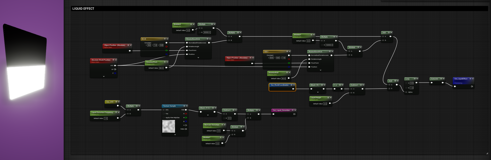

The two parameters that are driving the rotation called **WobbleX** and **WobbleY** respectively and they are actually the most important part of the effect.

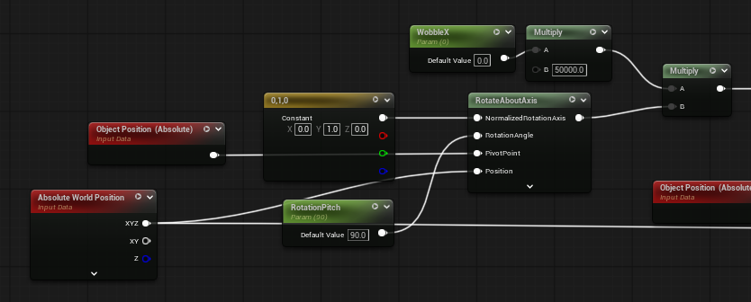

![[Pasted image 20251117150551.png]]

The height of the liquid is based on a simple gradient on** Z coordinates**. To make this work we should subtract the **Position** of the object from the World Position to, basically pin the mask on the object and don't be relative to world's coordinates.

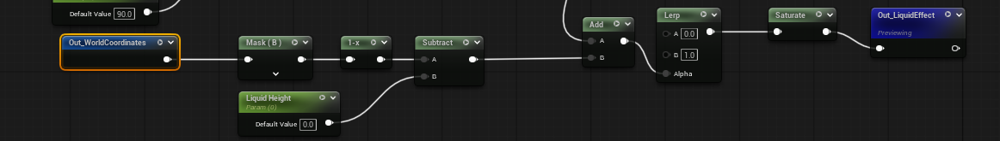
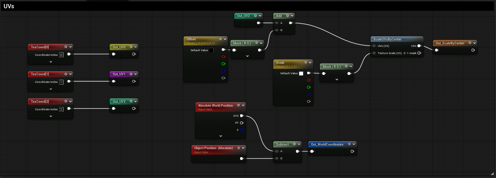

To finalize the look of the shader and especially make it fits the IP, we should create some floating glitter.

I tried to keep the shader as light weight as possible, so decided to use a simple noise texture with some contrast and intensity parameters to make the illusion of glitter on the Card's outer frame.

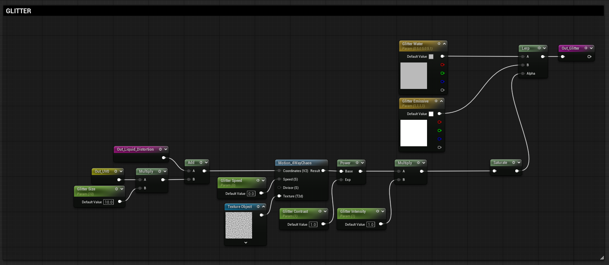

By combining different **Noise Normals** and a **gradient mask** for fake depth, we can make the liquid shader more convincing and appealing especially when the card is moving and the whole set up is fire up.

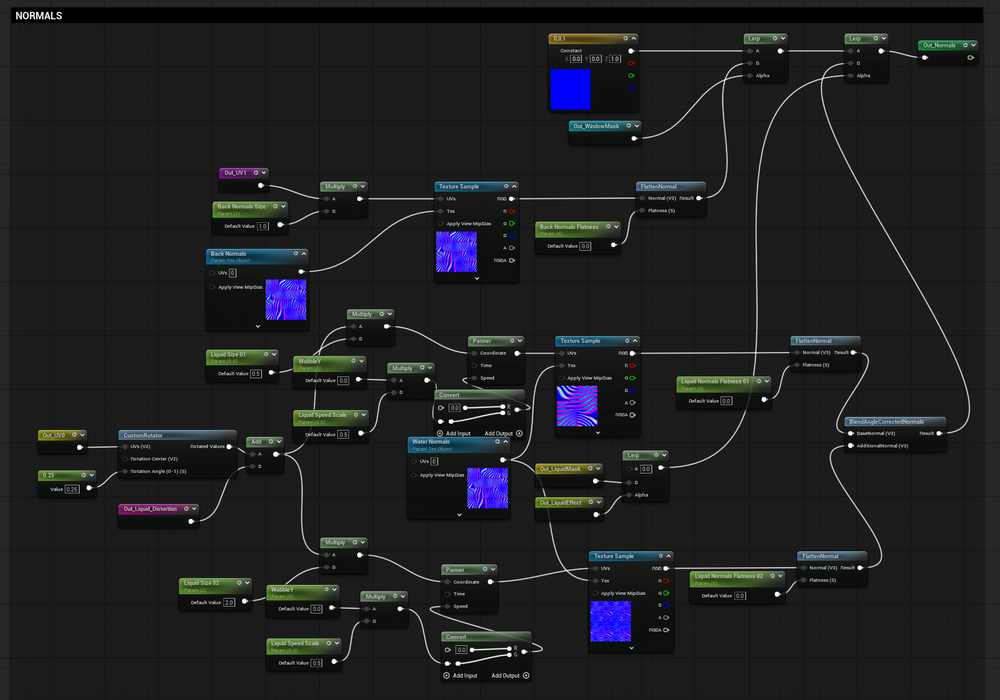

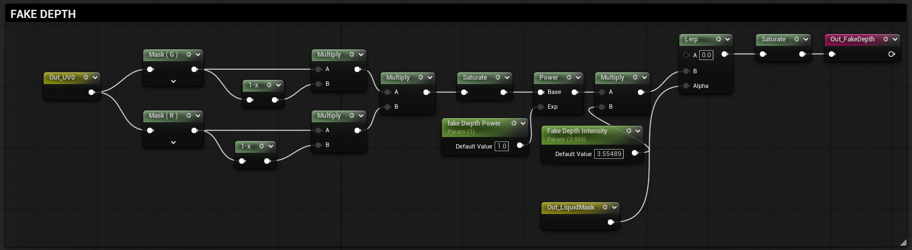

And what I mean with fire up?

The shader above is nothing if we don't applied into a **Blueprint logic** that calculates the pendulum motion of the effect based on the rotation and velocity of the card in runtime.

I tried a bunch of different methods to achieve this but I think that the most minimal but yet good looking is the following:

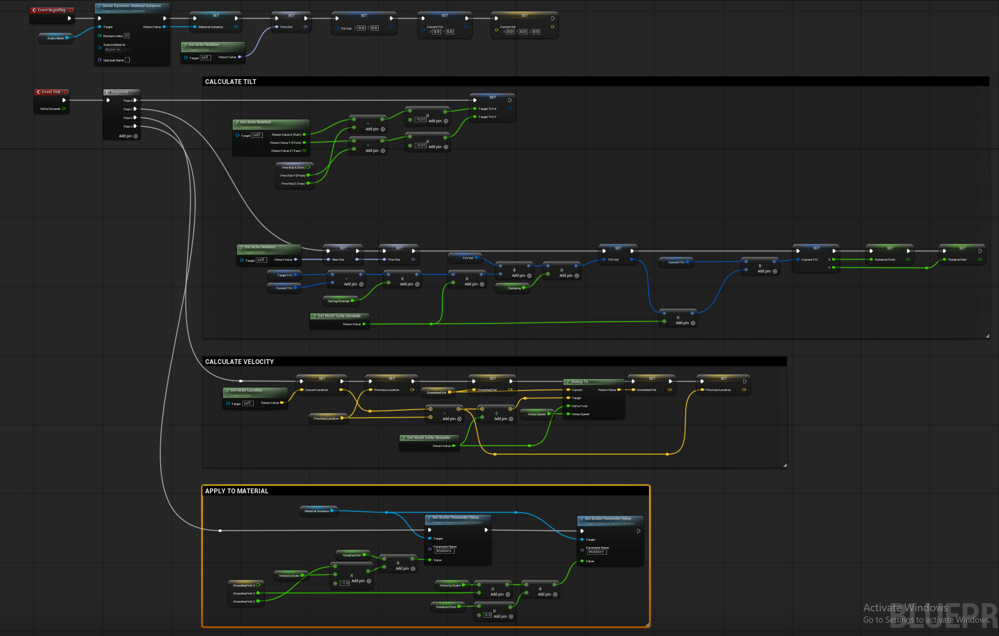

I figured that using a **Sequence node** was the easiest way to keep everything organized.

*Always keep in mind to SET every variable when you change its value if you want to use it later on.*

First of all we should initialize the core **Variables**.
Those are the Actor's rotation, the initial **Rotation, the Tilt parameters like current tilt and velocity based tilt and the initial Velocity**.

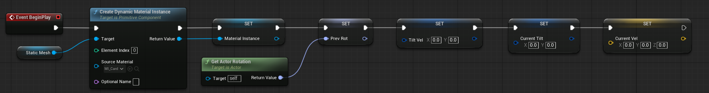

The tilt of the liquid is based on the **Pitch** and **Yaw** of the card.
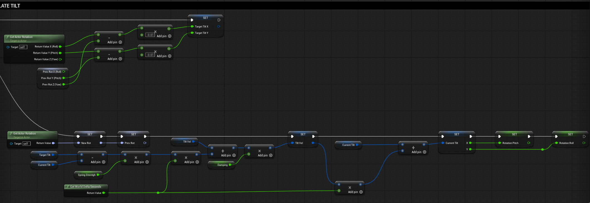

Then we calculate the Velocity of the card.

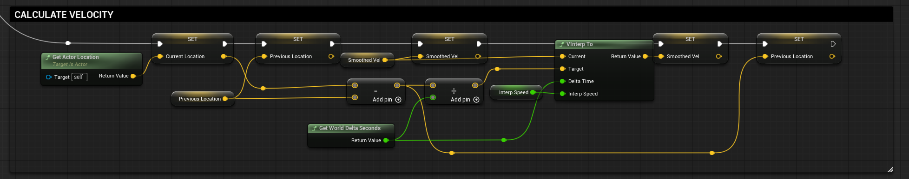

And wrap everything up by overwrite the WobbleX and WobbleY values of the material we created, based on the new Rotation and Velocity scales.

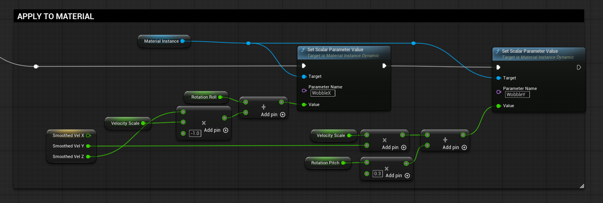

Now the liquid inside the card should be rotate when you move the card following a pendulum motion that smoothly returns to initial-resting position when the card stops.

## IRIDESCENT SURFACES

This kind of effects are really straight forward and easy to implement. In my take I used some noise textures (It is common to use **sine** waves instead) and a color gradient. The key component of the effect is the camera based coordinates that changes the look of the texture based on the angle view.

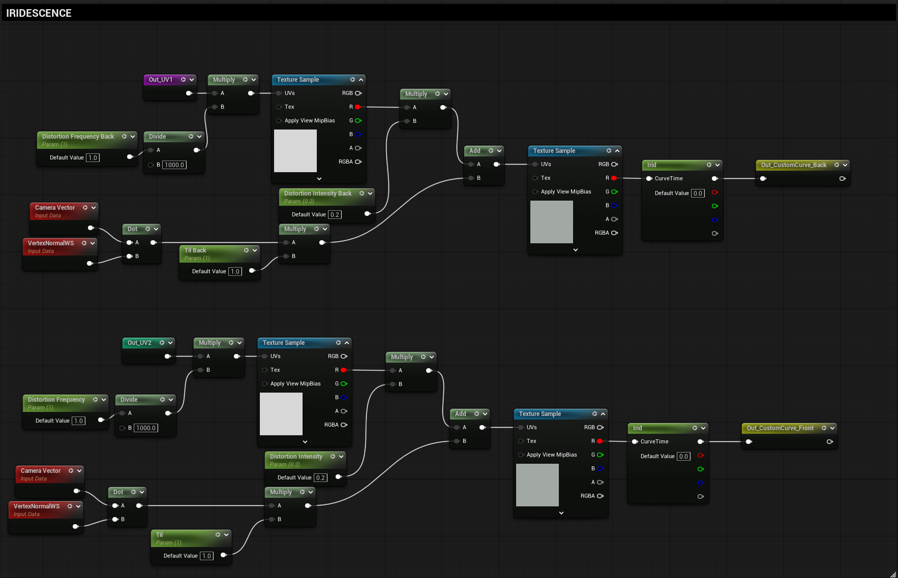

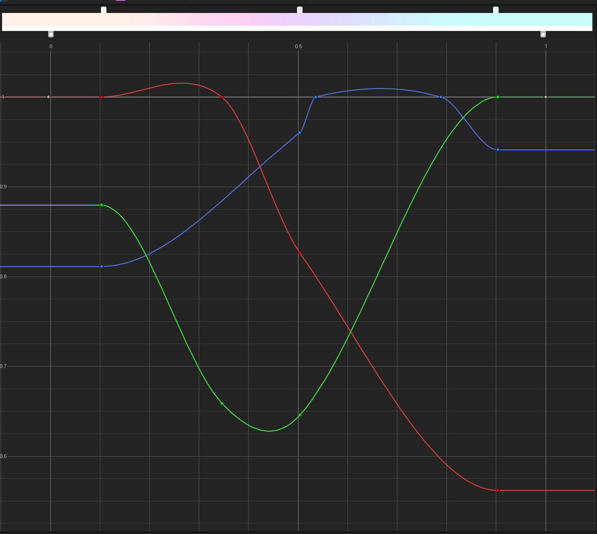

To make sure that the different effects will be applied on the specified areas, different techniques was used.

A common approach would be to create different materials for each part of the card but I don't believe that such a solution is reasonable for this kind of assets. Instead I used Vertex Colors and UV channels to separate the three main areas of the cards.

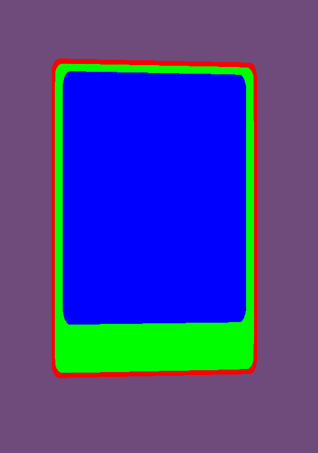
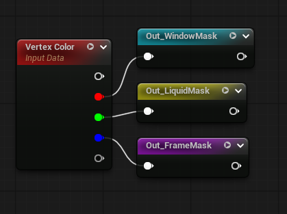

Additionally, I used different texture based masks to allow even more control over the shader.
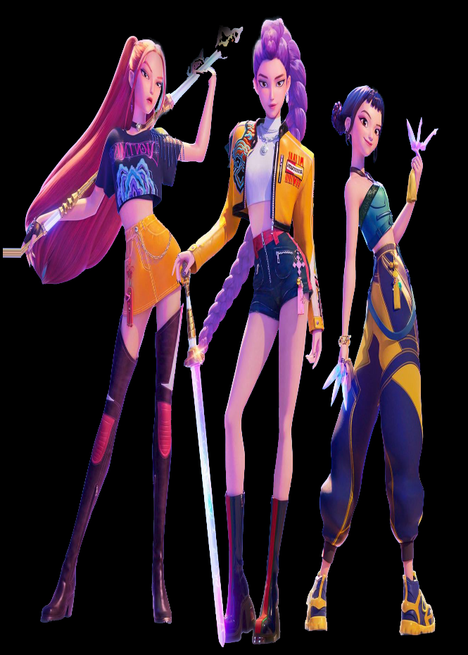
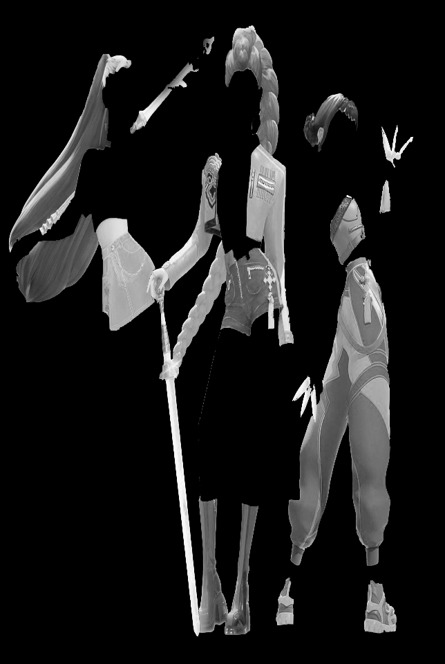
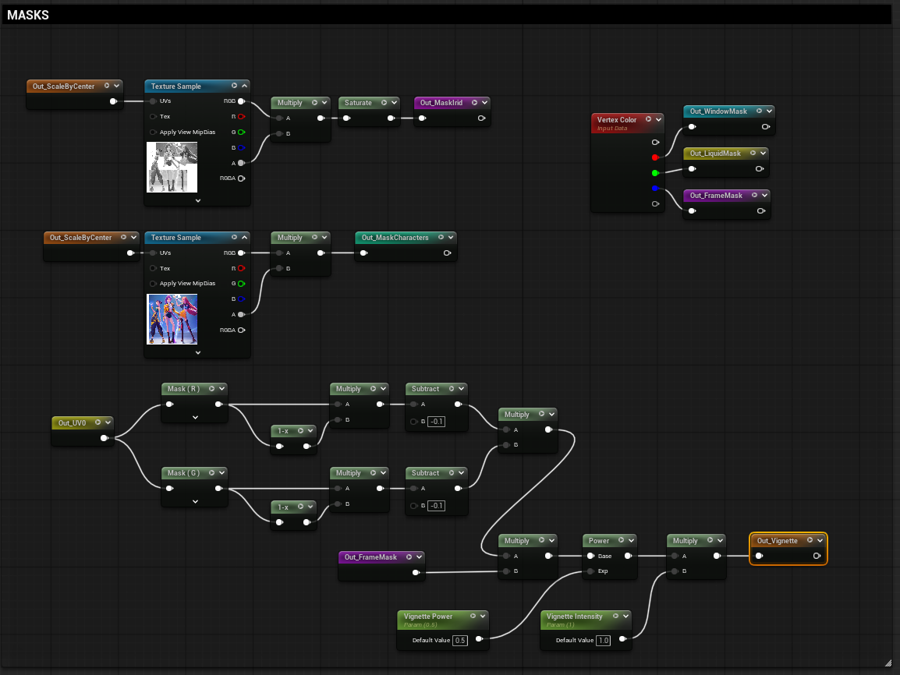

Whit this set up is really easy to create multiple complex masking systems for different kind of effects procedurally.

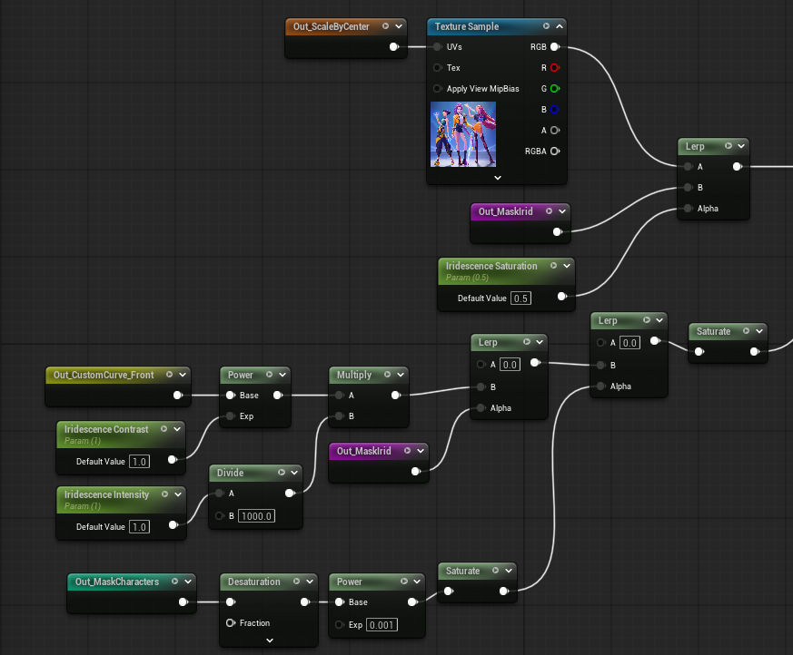
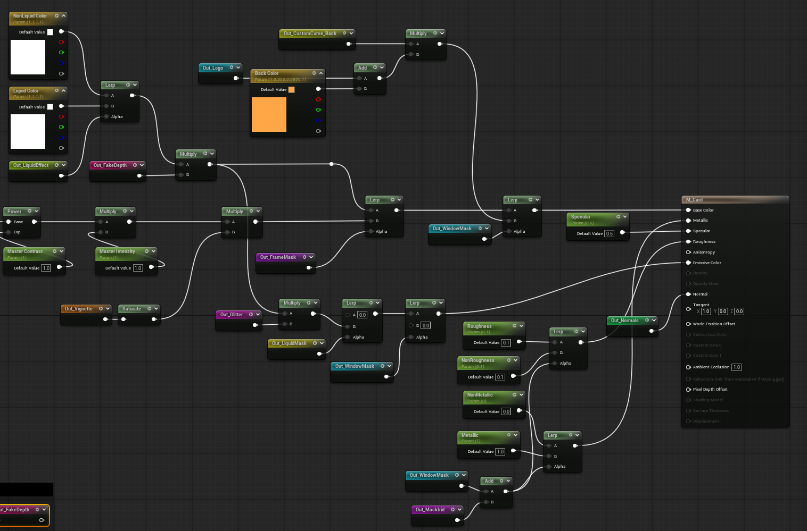

This project was just a study on shaders and complex masks. Although, it is not meant to be a actual game asset I tried to keep it as efficient as possible and built the shader as a real procedural tool. 

I hope that you found this breakdown interesting and inspiring. If you try it for yourself or have anything similar already developed don't hesitate to reaching out to discuss about it. There are always new tips and tricks that I would love to learn.
