---
title: "Magnifying Glass Part 1"
date: 2026-04-04
---



In the process of making a Magnifying Glass shader that actually works in game inside Unreal Engine, I had to create, well, the Magnifying Glass. I wanted a flexible workflow that would allow me fast iterations and control over the shape of the model without spending time on remodeling and retexturing. The creation of the model was made in parallel with the development of the shader, so a lot of things changed in the process and, as expected, the model needed to adjust to those changes many times.

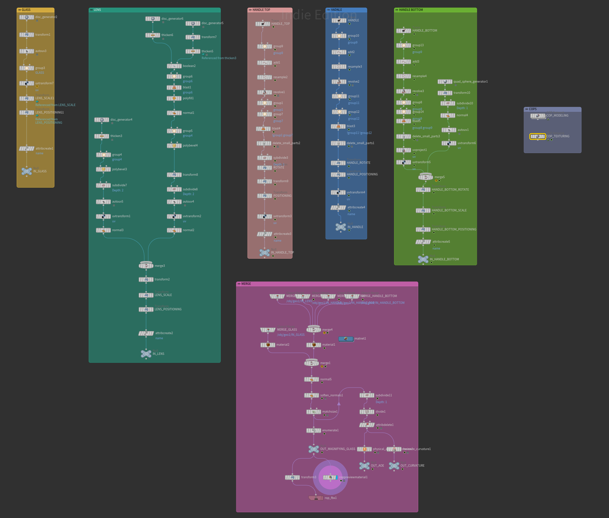

## Modeling with Copernicus

I decided that the best approach was a procedural modeling workflow inside Houdini's new texturing system, Copernicus. At first thought, a texturing and compositing framework is not the right environment to create accurate, production-ready models. But, in contrast, due to Houdini's interconnected nature of every tool, that was more than possible.

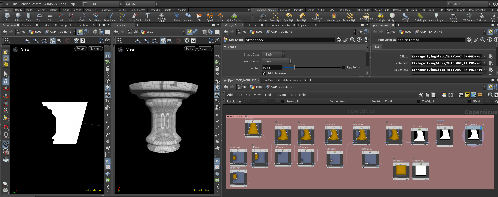

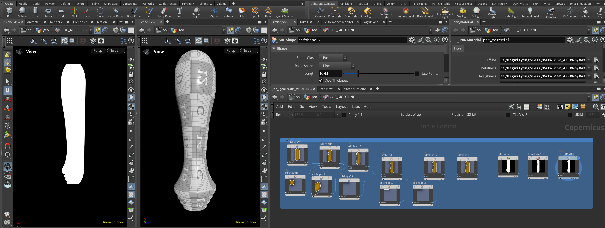

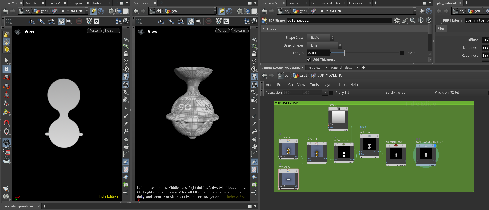

Copernicus gives a list of nodes for SDF shape creation and manipulation. Those SDFs can easily become geometry using the Trace node. Then, I cut the traced line in half and used a Revolve node to create the round shape for each part of the handle separately.

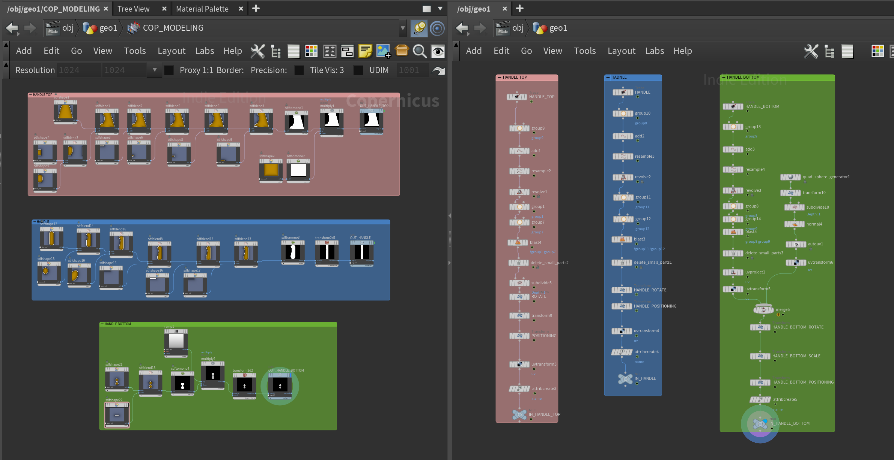

## Texturing

I gave two different materials to the model, one for the magnifying glass's body and one for the actual glass that will apply the shader (the shader will be further analyzed in Part 2). Also, used two different UV channels accordingly.

I took inspiration from some tutorials on texturing inside Copernicus from Entagma and decided to use a similar approach. Each part of the model had a different Name attribute, which, by using the Enumerate node, I managed to create different masks for each UV island separately. It's important to mention two very helpful nodes for Ambient Occlusion and Curvature that I'm always using when I'm creating procedural assets.

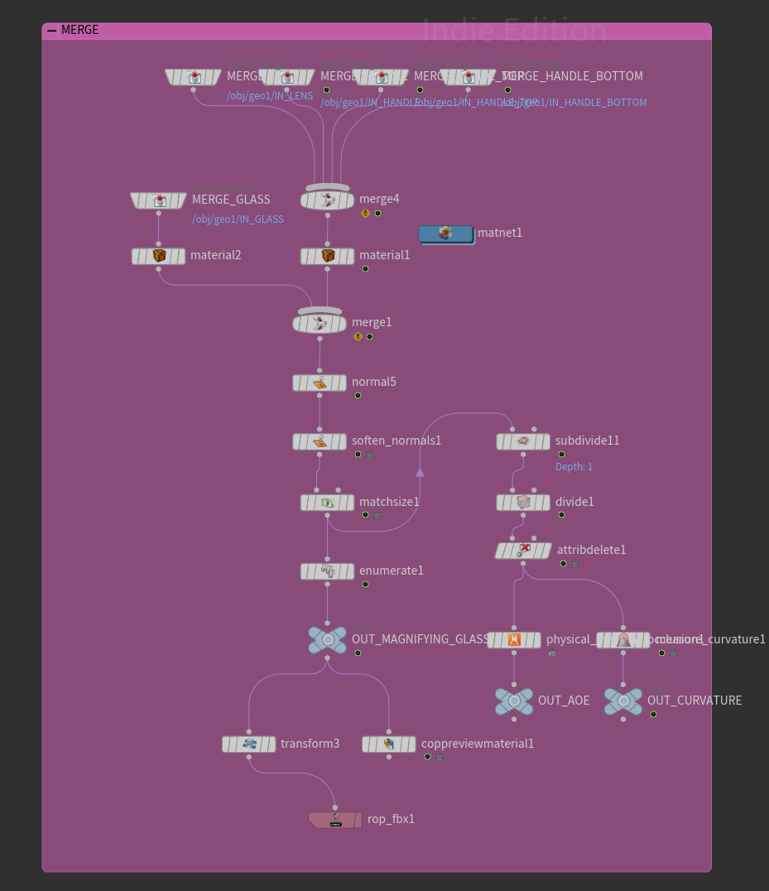

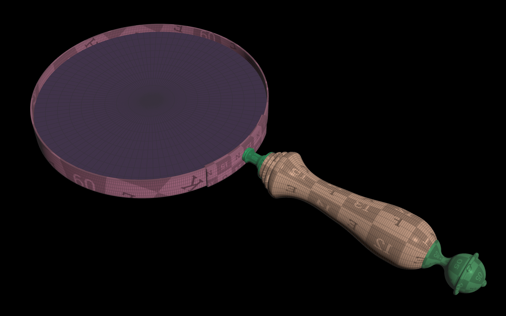
The different UV islands colorized based on their IDs.

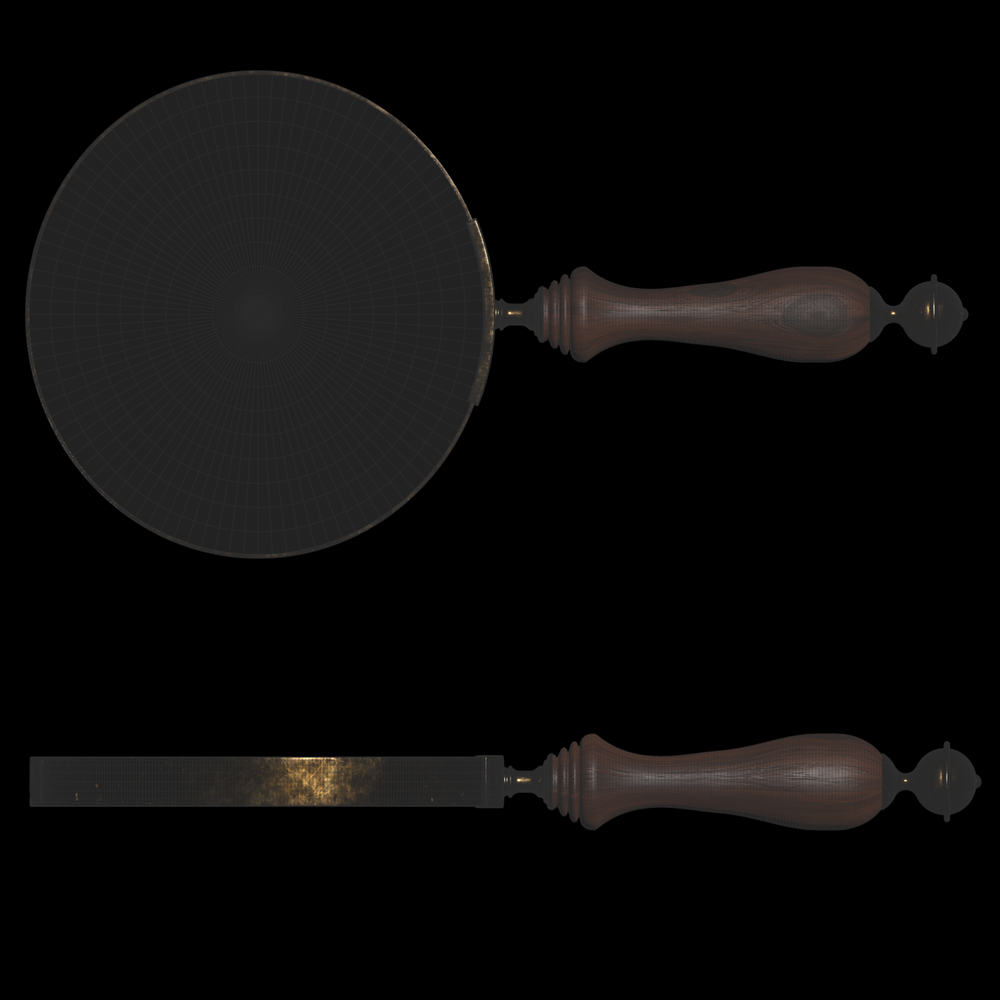
The model previewed inside Copernicus viewport.  

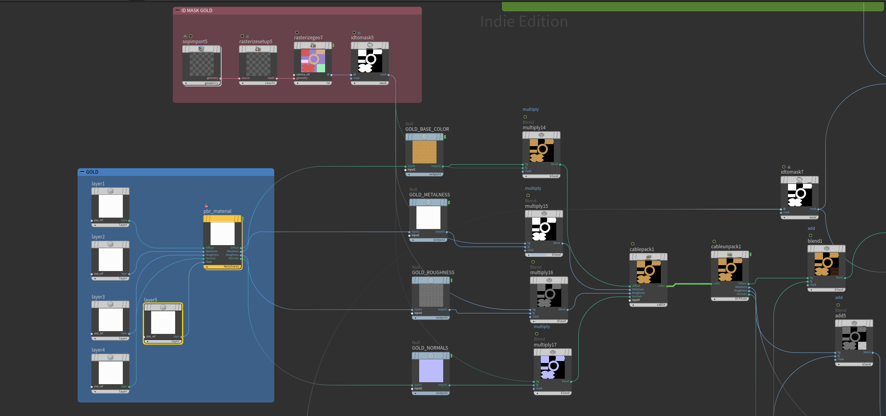

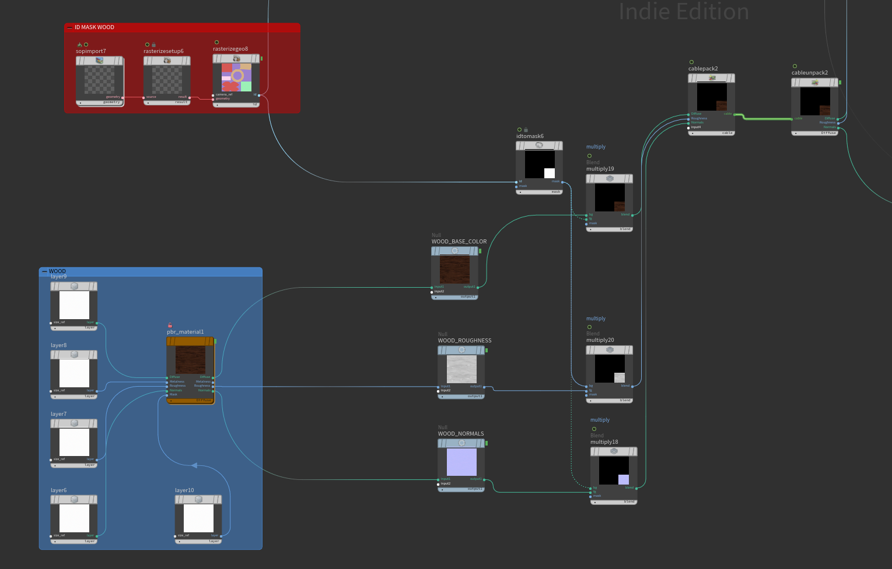

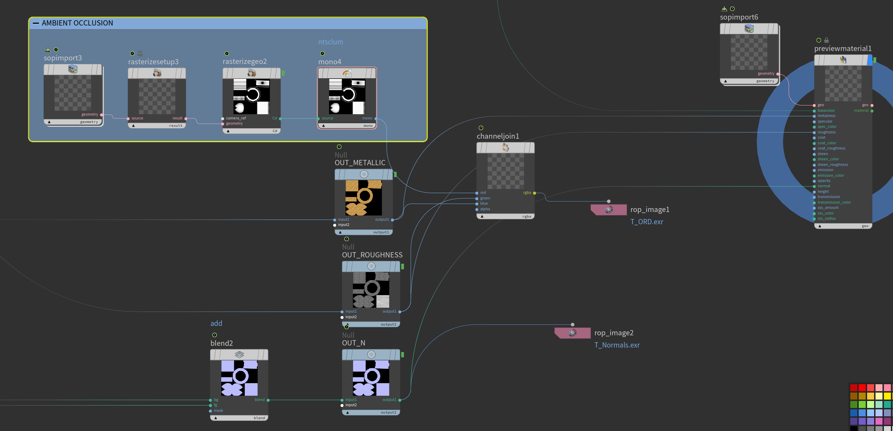

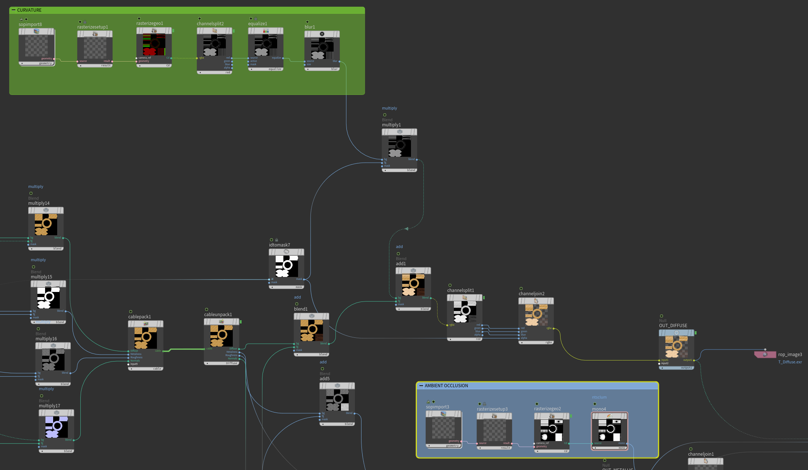

## Unreal implementation

Finally, I exported the three classic textures for Diffuse, ORM, and Normals. Also, added a fourth Mask texture in the Alpha channel of the Diffuse that I used inside Unreal Engine for the Wooden and Metallic parts of the model. That allowed me to control the exact look inside the Engine.

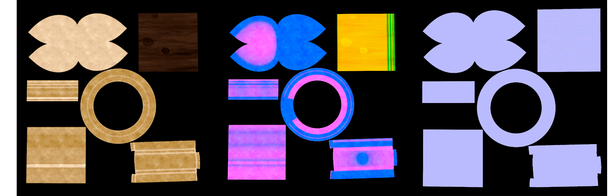

Eventually, I got the exact look I was looking for, really fast. In the next part, I will break down the development of the shader that actually gives this asset a reason to exist.

### Reference
Entagma's tutorials: https://www.youtube.com/watch?v=SWHxg1jLwTE&list=PLdFfFRXT0K_j26SKU7El34zItINJwFnW3